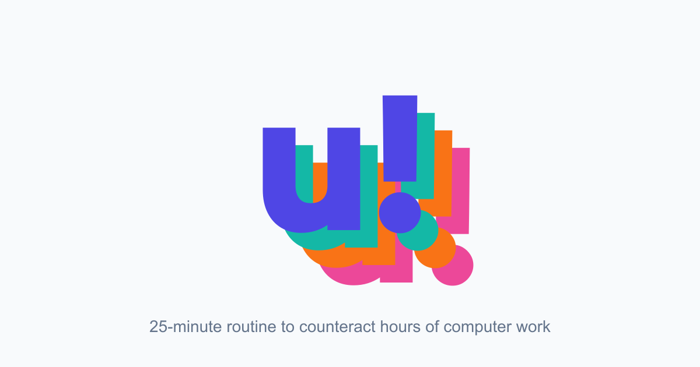

# unslump! 🧘‍♀️💻

**A science-backed 25-minute movement break for desk workers.**

unslump! is a bilingual Progressive Web App that guides office workers through a short corrective exercise routine designed to counteract long hours at a computer and support better posture.

<p align="center">
  
</p>

<p align="center">
  <a href="https://unslump.vercel.app"><strong>🌐 Live demo</strong></a>
  ·
  <a href="#-quick-start"><strong>Run locally</strong></a>
  ·
  <a href="#-why-unslump"><strong>Why it exists</strong></a>
</p>

---

## ✨ What it does

- ⏱️ **Guides a full 25-minute routine** with timers, prep periods, rests, and exercise navigation.
- 🧬 **Uses a 4-phase corrective protocol**: inhibit, lengthen, activate, integrate.
- 🌎 **Supports English and Spanish** with localized routes and SEO metadata.
- 📈 **Tracks progress locally** with `localStorage`, streaks, and completion state.
- 📱 **Works as a PWA** with manifest, service worker, installable icons, and offline support.
- 🧪 **Includes automated tests** with Vitest and Playwright.

## 🧠 Why unslump?

Desk work encourages the same posture for hours: rounded shoulders, forward head position, tight hip flexors, sleepy glutes, and stiff upper backs.

unslump! turns corrective exercise principles into a simple app flow:

| Phase | Goal |
| --- | --- |
| 1. Inhibit | Reduce overactivity in tight areas with myofascial release. |
| 2. Lengthen | Restore range of motion with targeted stretching. |
| 3. Activate | Wake up underused stabilizers and posture-supporting muscles. |
| 4. Integrate | Reinforce better movement with functional patterns. |

The routine references **30+ peer-reviewed studies** and keeps the user experience lightweight: open the app, press start, follow along.

## 🚀 Quick start

Requires Node.js 24.x and pnpm 11.13.1.

```bash
pnpm install
pnpm run dev
```

Then open one of the localized routes:

| Route | Purpose |
| --- | --- |
| `/en/` | English landing page |
| `/es/` | Spanish landing page |
| `/en/app` / `/es/app` | Exercise browser |
| `/en/workout` / `/es/workout` | Guided workout flow |

## 🛠️ Tech stack

| Area | Tooling |
| --- | --- |
| Framework | Astro 7 with server output and i18n routing |
| UI islands | Preact 10 |
| Styling | Tailwind CSS 4 |
| State | Nanostores 1 + browser storage |
| Motion | Motion 12 |
| Deployment | Vercel adapter |
| Tests | Vitest 4 + Playwright 1 |
| Runtime | Node.js 24.x |
| Package manager | pnpm 11.13.1 |

## 📦 Commands

```bash
pnpm run dev            # Start development server
pnpm run build          # Type-check and build for production
pnpm run preview        # Preview production build
pnpm test               # Run unit tests
pnpm test:coverage      # Run unit tests with coverage
pnpm test:e2e           # Run Playwright E2E tests
pnpm test:e2e:ui        # Run Playwright in UI mode
```

The migration baseline is 264 passing unit tests, 49 passing Chromium browser-flow tests, and 1 passing production offline PWA test, with 0 skipped. GitHub Actions runs install, Astro check, unit tests, build, Chromium E2E, and the dedicated production offline PWA test on pull requests and pushes to `main`.

## 🗂️ Project structure

```text
public/                 PWA icons, manifest, service worker, static assets
src/components/         Astro and Preact UI components
src/components/landing/ Landing page sections
src/components/workout/ Guided workout UI states
src/data/               Localized exercise data, references, and details
src/i18n/               Locale files and routing helpers
src/layouts/            Shared Astro layouts and SEO metadata
src/pages/              Localized Astro routes
tests/e2e/              Playwright E2E tests
```

## 🚢 Deployment

The project is configured for Vercel.

```bash
pnpm run build
```

| Vercel setting | Value |
| --- | --- |
| Build command | `pnpm run build` |
| Install command | `pnpm install` |
| Framework | Astro |

The canonical production URL is configured in `astro.config.mjs`.

## 📲 PWA notes

- The current service-worker cache is `unslump-v45`; increment `CACHE_NAME` in `public/sw.js` when deploying changes that must invalidate it.
- Keep app icons in `public/`: `icon-192.png`, `icon-512.png`, `maskable-192.png`, `maskable-512.png`, `apple-touch-icon.png`, and `og-image.png`.
- Test installability with Chrome DevTools → Application → Manifest and Lighthouse.

## 🤖 Agent instructions

Project-specific coding-agent guidance lives in [`AGENTS.md`](AGENTS.md). Pi loads `AGENTS.md` at startup, and compatible agents can use it for project conventions, commands, architecture notes, and testing guidance.

## ⚕️ Medical disclaimer

unslump! is an educational exercise app, not medical advice. Users with pain, injuries, medical conditions, or uncertainty about exercise safety should consult a qualified health professional.

## 📄 License

MIT — see [`LICENSE`](LICENSE).
